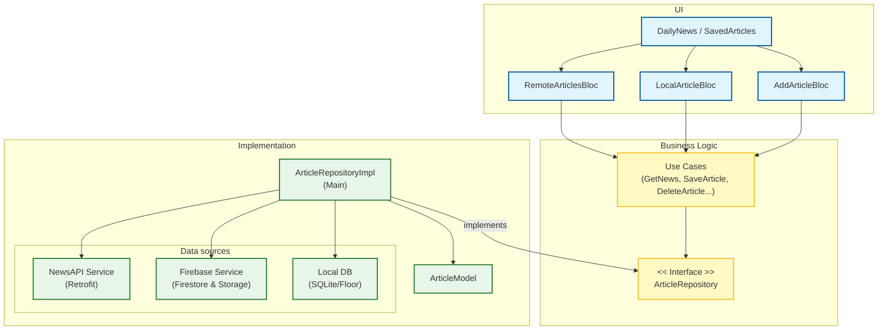

# Reporte de Desarrollo - Applicant Showcase App

Esta es la versión final del reporte en base a las instrucciones solicitadas por el proyecto original, para que sea de facil lectura. El reporte completo está en STEP_BY_STEP.

## 1. Introducción

### Preámbulo:

Al recibir el desafío de Symmetry, mi enfoque principal ha sido no solo cumplir con los requisitos funcionales, sino demostrar una comprensión profunda de la arquitectura de software escalable y la resolución de problemas en entornos híbridos.

### Objetivo del Proyecto:

El propósito principal fue implementar la funcionalidad de Periodista en la App existente, permitiendo crear, visualizar y gestionar contenido propio. He integrado una solución completa que abarca desde la interfaz de usuario (Flutter) hasta el backend (Firebase), orquestada bajo una estricta Clean Architecture que permite la coexistencia de datos locales y remotos.

## 2. Arquitectura

Realizado usando mermaid.js

## 3. Proceso de Aprendizaje

Abordé este proyecto como la construcción de un edificio robusto, comenzando por los cimientos (Datos) antes de elevar las paredes (Presentación).

1. **Cimientos (Data Layer):** Comencé definiendo los modelos y las fuentes de datos. La decisión crítica fue elegir **Firebase** como backend por su agilidad y capacidad serverless, ideal para un proyecto robusto, frente a desarrollar una API REST propia que, aunque ofrecería control total (p.ej. con Rust o Elixir), excedería el alcance temporal y sería innecesario para este simple proyecto de muestra de caapcidades.

2. **Estructura (Domain Layer):** Creé casos de uso específicos (`CreateArticle`, `DeleteArticle`) para asegurar que cada operación de "Domain" estuviera aislada y fuera testeable.

3. **Paredes (Presentation Layer):** Finalmente, conecté todo mediante el patrón BLoC, asegurando que la UI fuera puramente reactiva y libre de lógica de "Domain".

**Tecnologías Clave:**

- **Flutter & Dart:** Base sólida previa.

- **Firebase (Firestore & Storage):** Implementación de reglas de seguridad y consultas compuestas.

- **Clean Architecture & BLoC:** Aplicación de separación de responsabilidades.

## 4. Desafíos y Soluciones

Durante el desarrollo, me enfrenté a desafíos técnicos significativos que requirieron soluciones creativas:

### A. El Conflicto de Identidad

Problema: Al intentar guardar noticias en la base de datos local (SQLite), el sistema fallaba con UNIQUE constraint failed.

Causa: La API externa (newsapi) devuelve artículos con id: null, mientras que Firebase usa UUIDs. SQLite no podía distinguir entre dos artículos con ID nulo.

Implementé una "Identidad Falsa" en el ArticleModel. Si el artículo carece de ID, genero uno determinista basado en su URL (única). Además, actualicé la estrategia de conflicto del DAO a OnConflictStrategy.replace para mayor robustez.

### B. Red Local

En el emulador, la subida de imágenes quedaba en carga infinita, ya que Android bloqueaba el tráfico HTTP no seguro (cleartext) necesario para comunicarme con el emulador local de Firebase.

Aplicando el "Truth is King", decidí migrar y validar directamente contra el entorno de producción de Firebase, eliminando falsos positivos del entorno de simulación y garantizando permisos reales.

### C. Dismissible State Error

Excepción "A dismissed Dismissible widget is still part of the tree" al borrar una noticia, ya que la operación de borrado en la nube tardaba más que la animación de la UI.

Para solucionarlo, el estado de la lista se actualiza visualmente de inmediato, eliminando el elemento antes de esperar la confirmación del servidor, mejorando la percepción de velocidad. En caso de que falle la solicitud del servidor, vuelvo a añadirlo a la UI.
Lo que uno piensa al principio es poner una pantalla de carga, pero para este caso mi solución la veo mucho mas limpia.

## 5. Registro de Decisiones Técnicas

| **Desafío**           | **Opciones Consideradas**          | **Decisión Tomada**          | **¿Porque?**                                                                                                      |
| --------------------- | ---------------------------------- | ---------------------------- | ----------------------------------------------------------------------------------------------------------------- |
| **Backend**           | Custom API (Node/Rust) vs Firebase | **Firebase**                 | Velocidad de implementación, gestión de imágenes "out-of-the-box" y alineación con el stack móvil.                |
| **Persistencia**      | Guardar todo local vs Híbrido      | **Híbrido**                  | Datos críticos (likes globales) en nube; Preferencias (favoritos) en local. Cumple principio KISS y ahorra datos. |
| **Gestión de Estado** | Reutilizar BLoC vs Crear Nuevo     | **Separar (AddArticleBloc)** | El flujo de "Creación" tiene estados únicos (Subiendo Imagen) que ensuciarían el BLoC de lectura.                 |
| **Borrado**           | Botón simple vs Swipe              | **Swipe to Delete**          | Mejor UX. Se añadió lógica de protección para impedir borrar noticias de la API externa (solo propias).           |

## 6. Reflexion y camino a seguir

El proyecto cumple con los requisitos funcionales y de calidad. La arquitectura es modular, testeable y escalable.

Reflexión sobre Escalabilidad:

El modelo actual de actualización bajo demanda (polling al volver de una pantalla) es funcional pero no óptimo para alta concurrencia.

La evolución lógica sería implementar una arquitectura orientada a eventos usando Streams de Firestore. Esto transformaría la app de un modelo "Pull" a uno "Push", donde el servidor notifica al cliente en tiempo real de nuevas noticias, similar a la arquitectura de sockets de Discord.

Estrategia de Testing:

Si dispusiera de más tiempo, implementaría:

1. **Unit Tests:** Usando `bloc_test` para validar la emisión de estados optimistas en `RemoteArticlesBloc`.

2. **Widget Tests:** Para asegurar que el widget `Dismissible` no permite deslizar noticias de terceros.

## 7. Proof of the Project

[🎥 Ver Demo Completa en Google Photos](https://photos.app.goo.gl/jCg5PT9xjJ2ixZRT6)

## 8. Overdelivery (Valor Añadido)

Siguiendo el valor de "Maximally Overdeliver", he implementado características no solicitadas que elevan la calidad del producto:

1. **Feed Híbrido Resiliente:** Sistema capaz de mezclar noticias de API y Firebase, priorizando el contenido propio y tolerando fallos parciales de la red.

2. **Gestión de Medios Robusta:** Manejo de errores en carga de imágenes y URLs de fallback para evitar "crashes" visuales.

3. **UX Reactiva:** Botones de estado (Bookmark) que reaccionan en tiempo real a la base de datos local.

4. **Seguridad en Borrado:** Lógica de negocio que protege los artículos de la API pública contra intentos de borrado accidental.

5. **Clean Code:** Refactorización de código para cumplir con estándares modernos (Null Safety, Interceptores de Dio, etc).

### **Testing**

Aunque el alcance de este proyecto priorizó la implementación de funcionalidades complejas, el siguiente paso crítico para un entorno de producción sería proteger la aplicación con una serie de **tests automatizados**. Dado que la arquitectura sigue estrictamente los principios de **Clean Architecture**, la testeabilidad es alta. Esta sería mi estrategia de implementación:

**1. Unit Testing** Utilizaría las librerías `bloc_test` y `mockito` para validar la lógica de "Domain" aislada.

- **Target:** `RemoteArticlesBloc`.

- **Escenario a Testear:** Validar el patrón de **Optimistic Update** implementado en el borrado.
    
    - Al recibir el evento `DeleteArticle`, el BLoC debe emitir inmediatamente un estado `RemoteArticlesDone` con la lista reducida (para satisfacer a la UI), antes de invocar al caso de uso.
        
    - _Mocking:_ Simularía una respuesta exitosa y una fallida del `DeleteArticleUseCase` para asegurar que, en caso de error en el servidor, el artículo se "re-inserte" en la lista.

**2. Integration Testing (Capa de Datos)** Validaría la funcionalidad del `ArticleRepositoryImpl` sin depender de servicios reales.

- **Target:** El método `getNewsArticles` (Feed Híbrido).

- **Escenario:** Simular que `NewsApiService` lanza una excepción (servidor caído) mientras que `FirebaseService` devuelve datos correctamente.
    
    - _Objetivo:_ Asegurar que el repositorio captura la excepción silenciosamente y retorna un `DataSuccess` con solo los artículos de Firebase, garantizando la dualidad del sistema.

**3. Widget Testing** Usaría `flutter_test` para asegurar que las reglas de protección de la UI son perfectas.

- **Por ejemplo:** El widget `Dismissible` en `DailyNews`.

- **Escenario:** Renderizar la lista con un artículo de API (ID URL) y un artículo propio (ID UUID). Intentar realizar el gesto de _swipe_ sobre el artículo de la API y verificar que el widget `Dismissible` no se activa o no existe en el árbol de widgets para ese elemento específico, confirmando que la lógica de seguridad visual funciona.
